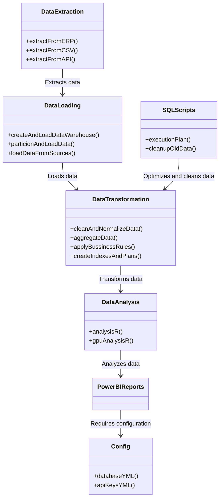
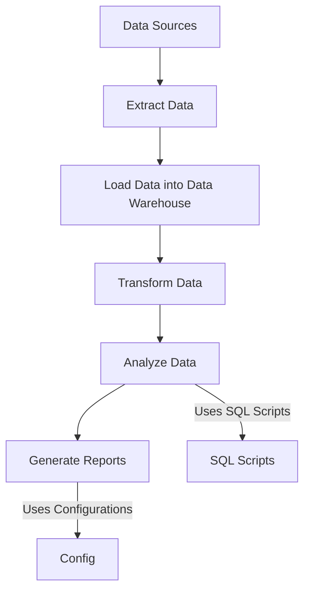

# Audit Automation

Este projeto automatiza o processo de extração, transformação, carregamento, análise e visualização de dados de auditoria, utilizando técnicas avançadas de paralelização e computação com GPU para otimização de performance.

## Resumo

Este projeto é uma solução completa para automação de auditorias, envolvendo extração, transformação, carregamento, análise e visualização de dados com otimização de performance.

## Conceitos Aplicados

- **Extração de Dados:** Uso de SSIS para extração de dados de sistemas ERP, arquivos CSV e APIs de auditoria.
- **Transformação de Dados:** Limpeza, normalização, agregação e aplicação de regras de negócio em SQL com paralelização.
- **Análise de Dados:** Utilização de R para análises estatísticas avançadas com paralelização e computação com GPU.
- **Visualização de Dados:** Relatórios interativos no Power BI para métricas, outliers e correlações.
- **Otimização de Performance:** Implementação de índices, cache e planos de execução para otimização de consultas SQL.

## Estrutura do Projeto

- **data_extraction:** Scripts SSIS para extração de dados.
- **data_loading:** Scripts para criação e carregamento do data warehouse com particionamento e paralelização.
- **data_transformation:** Scripts SQL para limpeza, normalização e agregação de dados com paralelização.
- **data_analysis:** Scripts R para análise de dados com paralelização e computação com GPU.
- **power_bi_reports:** Relatórios Power BI para visualização de dados.
- **config:** Arquivos de configuração para banco de dados e chaves de API.
- **sql_scripts:** Scripts SQL para criação de índices, planos de execução e limpeza de dados antigos.

## Diagrama UML

### Diagrama de Classes

### Diagrama de Fluxo de Dados:
